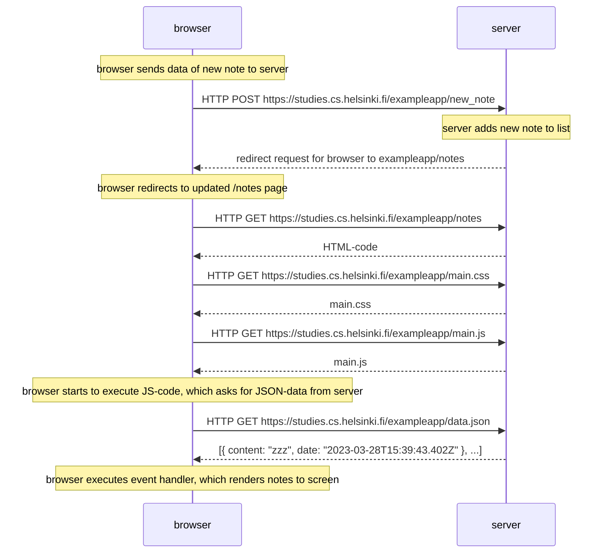

```mermaid
sequenceDiagram
    participant browser
    participant server

    Note over browser: browser sends data of new note to server
    browser->>server: HTTP POST https://studies.cs.helsinki.fi/exampleapp/new_note
    Note over server: server adds new note to list
    server-->>browser: redirect request for browser to exampleapp/notes
    Note over browser: browser redirects to updated /notes page
    browser->>server: HTTP GET https://studies.cs.helsinki.fi/exampleapp/notes
    server-->>browser: HTML-code
    browser->>server: HTTP GET https://studies.cs.helsinki.fi/exampleapp/main.css
    server-->>browser: main.css
    browser->>server: HTTP GET https://studies.cs.helsinki.fi/exampleapp/main.js
    server-->>browser: main.js
    Note over browser: browser starts to execute JS-code, which asks for JSON-data from server
    browser->>server: HTTP GET https://studies.cs.helsinki.fi/exampleapp/data.json
    server-->>browser: [{ content: "zzz", date: "2023-03-28T15:39:43.402Z" }, ...]
    Note over browser: browser executes event handler, which renders notes to screen
```
