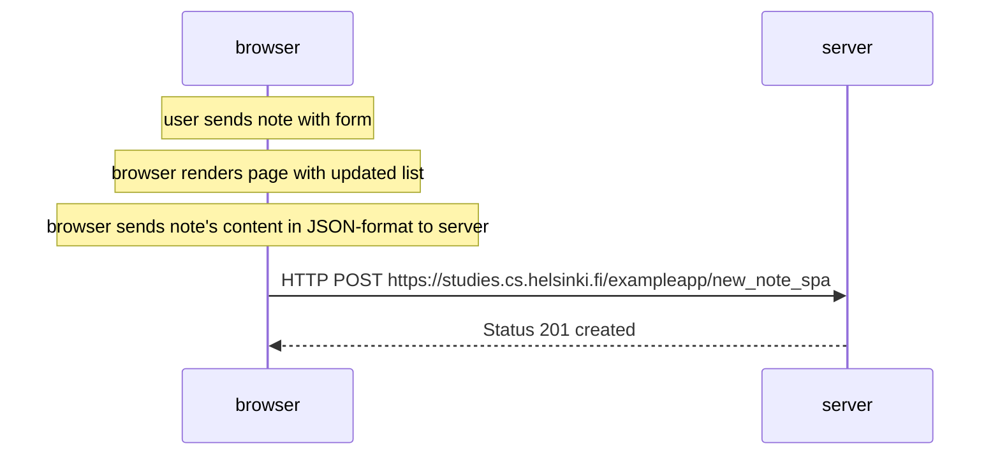

```mermaid
sequenceDiagram
    participant browser
    participant server

    Note over browser: user sends note with form
    Note over browser: browser renders page with updated list
    Note over browser: browser sends note's content in JSON-format to server
    browser->>server: HTTP POST https://studies.cs.helsinki.fi/exampleapp/new_note_spa
    server-->>browser: Status 201 created
```
